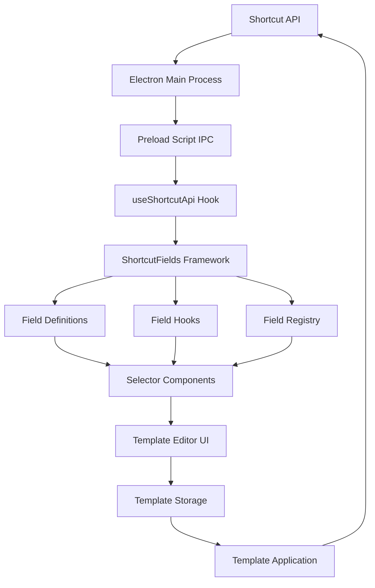
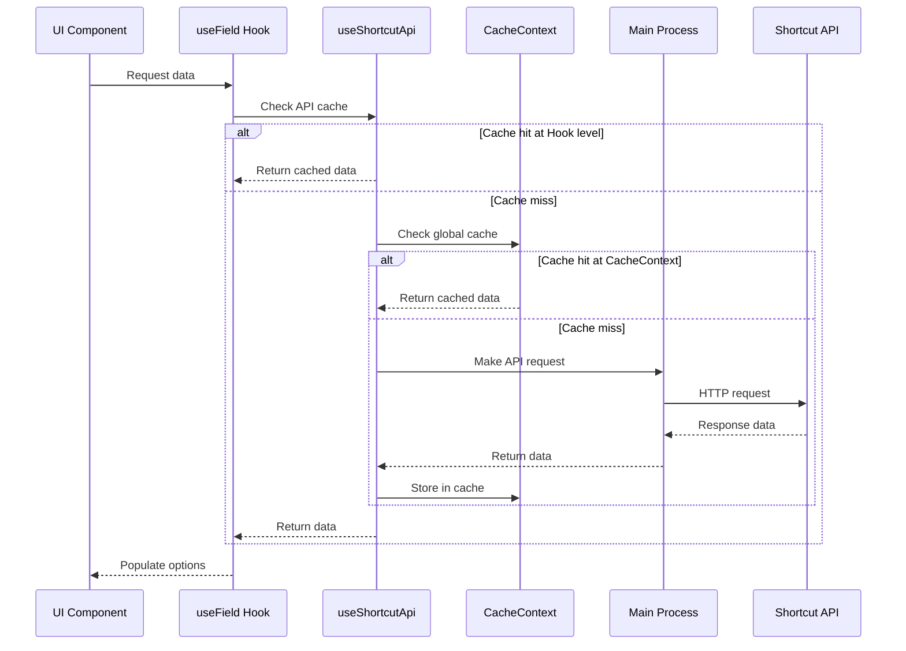

# Shortcut Selectors - Implementation Guide

This document provides a comprehensive guide on how selectors are implemented in the Shortcut-Shortcut application, and how to create new selectors based on Shortcut API data.

## Table of Contents

1. [Selector Architecture Overview](#selector-architecture-overview)
2. [Selector Types and Components](#selector-types-and-components)
3. [Implementation Process](#implementation-process)
4. [Template Integration](#template-integration)
5. [Practical Examples](#practical-examples)

## Selector Architecture Overview

The selector system in this application spans multiple architectural layers, from the Shortcut API to the UI components.

### Data Flow Architecture



### Component Structure

The selector system consists of the following key components:

1. **Electron Main Process API Handlers**
   - Makes HTTP requests to Shortcut API
   - Returns standardized response objects
   - Implements error handling

2. **useShortcutApi Hook**
   - Provides API access to React components
   - Implements caching for API data
   - Manages token validation

3. **ShortcutFields Framework**
   - Field definitions that describe how to fetch and display data
   - Hooks for managing field state
   - Registry for organizing field types
   - Component factories for creating selectors

4. **UI Components**
   - CyberSelect for single selection
   - CyberMultiSelect for multiple selections
   - Field selector components

### Caching System

Selectors utilize a multi-level caching system to optimize performance:



## Selector Types and Components

The application uses several types of selectors to handle different scenarios.

### Single Selectors

Used for selecting a single value from a list of options.

**Example: Epic State Selector**

```tsx
<EpicStateSelector
  value={epicDetails.epic_state_id || null}
  onChange={handleEpicStateChange}
  fullWidth
/>
```

### Multi-Selectors

Used for selecting multiple values from a list of options.

**Example: Owners Selector**

```tsx
<MemberMultiSelect
  value={epicDetails.owner_ids || []}
  onChange={handleOwnersChange}
  shortcutApi={shortcutApi}
/>
```

### Dependent Selectors

Used when one selector's options depend on the selection in another selector.

**Example: Workflow and State Selector**

```tsx
<WorkflowAndStateSelector
  parentValue={story.workflow_id ? Number(story.workflow_id) : null}
  childValue={story.workflow_state_id ? Number(story.workflow_state_id) : null}
  onParentChange={handleWorkflowChange}
  onChildChange={handleWorkflowStateChange}
  disabled={!shortcutApi.hasApiToken}
  fullWidth
/>
```

## Implementation Process

Creating a new selector involves several steps across different parts of the application.

### 1. Add API Endpoint in Main Process

Add a new handler in `src/main/main.ts`:

```typescript
ipcMain.handle('shortcut-fetchGroups', async (_, apiToken: string) => {
  if (!apiToken) {
    return { success: false, message: 'API token is required' };
  }
  
  try {
    const client = createShortcutClient(apiToken);
    const response = await client.get('/groups');
    
    console.log('Groups API response count:', response.data.length);
    
    return { success: true, data: response.data };
  } catch (error) {
    console.error('Error fetching groups:', error);
    return handleApiError(error);
  }
});
```

### 2. Add API Interface in Preload Script

Update the API interface in `src/main/preload.ts`:

```typescript
// Add to the shortcutApi object
shortcutApi: {
  // Existing methods...
  fetchGroups: (apiToken: string) => 
    ipcRenderer.invoke('shortcut-fetchGroups', apiToken),
}
```

### 3. Add Fetch Method to useShortcutApi Hook

Add a new fetch method in `src/renderer/hooks/useShortcutApi.ts`:

```typescript
/**
 * Fetch all groups from Shortcut
 */
const fetchGroups = useCallback(async () => {
  if (!apiToken) {
    throw new Error('API token is not set');
  }
  
  // Create a cache key for this API call
  const cacheKey = createCacheKey('groups', apiToken);
  
  // Check if we have a valid cache entry
  const cachedData = getCache(cacheKey);
  if (cachedData) {
    console.log('Using cached groups data');
    return cachedData;
  }
  
  // If no cache hit, fetch from API
  const api = window.electronAPI as ShortcutElectronAPI;
  const response = await api.shortcutApi.fetchGroups(apiToken);
  if (!response.success) {
    throw new Error(response.message || 'Failed to fetch groups');
  }
  
  // Store successful response in cache
  setCache(cacheKey, response.data || []);
  
  return response.data || [];
}, [apiToken, getCache, setCache]);

// Don't forget to add the method to the return object
return {
  // Existing methods...
  fetchGroups,
};
```

### 4. Create Field Definition

Add a new field definition in `src/renderer/components/ShortcutFields/fieldDefinitions.ts`:

```typescript
/**
 * Group Field Definition
 */
export const groupField: FieldDefinition<ShortcutGroup> = {
  id: 'group',
  type: 'single',
  label: 'Group',
  helperText: 'Select a group',
  
  async fetch(api) {
    return api.fetchGroups();
  },
  
  getOptionLabel(group) {
    return group.name;
  },
  
  getOptionValue(group) {
    return group.id.toString();
  },
  
  // ID-based lookup methods
  getIdFromValue(group) {
    return group.id;
  },
  
  findOptionById(options, id) {
    const numericId = typeof id === 'string' ? parseInt(id, 10) : id;
    return options.find(option => option.id === numericId) || null;
  }
};

// Add to fieldDefinitions object
export const fieldDefinitions = {
  // Existing fields...
  group: groupField,
};
```

### 5. Create Selector Component

Add a new component export in `src/renderer/components/ShortcutFields/index.ts`:

```typescript
// Create and export pre-built component
export const GroupSelector = createFieldComponent(groupField);
```

### 6. Use the New Selector in UI

Implement the selector in your UI component:

```tsx
import { GroupSelector } from '../ShortcutFields';

// Inside your component
const handleGroupChange = (group: ShortcutGroup | null) => {
  if (group) {
    onStateChange({
      target: {
        name: 'group_id',
        value: group.id
      }
    });
  } else {
    onStateChange({
      target: {
        name: 'group_id',
        value: undefined
      }
    });
  }
};

// In your JSX
<GroupSelector
  value={epicDetails.group_id || null}
  onChange={handleGroupChange}
  fullWidth
/>
```

## Template Integration

The selector system is integrated with the template creation and application flow.

### Storing Selected Values in Templates

When a user selects a value in a selector:

1. The onChange handler is called with the selected object
2. The handler extracts relevant data (usually an ID) from the object
3. The ID is stored in the template state
4. The template is automatically saved to electron-store

Example from `EpicDetailsEditor.tsx`:

```typescript
const handleEpicStateChange = (state: ShortcutEpicState | null) => {
  if (state) {
    // Update the display name for backwards compatibility
    onStateChange({
      target: {
        name: 'state',
        value: state.name
      }
    });
    
    // Also update the epic_state_id for API use
    onStateChange({
      target: {
        name: 'epic_state_id',
        value: state.id
      }
    });
  } else {
    // Reset both values if no state is selected
    onStateChange({
      target: {
        name: 'state',
        value: ''
      }
    });
    
    onStateChange({
      target: {
        name: 'epic_state_id',
        value: undefined
      }
    });
  }
};
```

### Applying Templates with Selected Values

When a template is applied:

1. The template data is loaded from electron-store
2. Any template variables are processed/replaced
3. The template is sent to the Shortcut API to create epics and stories
4. The stored IDs from selectors are used in the API calls

The key method for this is `createEpicWithStories` in `useShortcutApi.ts`:

```typescript
const createEpicWithStories = useCallback(
  async (
    epicData: {
      name: string;
      description: string;
      state: string;
      [key: string]: any; // Allow any additional fields from the template
    },
    workflowId: string,
    stories: Array<{
      name: string;
      description: string;
      type: string;
      state: string;
      workflow_state_id?: string;
      estimate?: number;
      labels?: string[];
      owner_ids?: string[];
      iteration_id?: number;
    }>
  ) => {
    // Creates epic with all fields from epicData
    // Creates stories with their respective fields
    // Returns epicId and storyIds
  }
);
```

## Practical Examples

### Example 1: Creating a Group Selector

Let's implement a single selector for Shortcut Groups.

#### 1. Add TypeScript Interface

Add to `src/renderer/types/shortcutApi.ts`:

```typescript
export interface ShortcutGroup extends ShortcutEntity {
  name: string;
  description: string;
  mention_name: string;
  color: string;
}
```

#### 2. Update ShortcutElectronAPI Type

Update in `src/renderer/hooks/useShortcutApi.ts`:

```typescript
type ShortcutElectronAPI = {
  shortcutApi: {
    // Existing methods...
    fetchGroups: (apiToken: string) => Promise<ShortcutApiResponse>;
  };
  // Other properties...
};
```

#### 3. Add Field Definition

Add to `src/renderer/components/ShortcutFields/fieldDefinitions.ts`:

```typescript
export const groupField: FieldDefinition<ShortcutGroup> = {
  id: 'group',
  type: 'single',
  label: 'Group',
  helperText: 'Select a group',
  
  async fetch(api) {
    return api.fetchGroups();
  },
  
  getOptionLabel(group) {
    return group.name;
  },
  
  getOptionValue(group) {
    return group.id.toString();
  },
  
  getIdFromValue(group) {
    return group.id;
  },
  
  findOptionById(options, id) {
    const numericId = typeof id === 'string' ? parseInt(id, 10) : id;
    return options.find(option => option.id === numericId) || null;
  }
};

// Add to fieldDefinitions
export const fieldDefinitions = {
  // Existing fields...
  group: groupField,
};
```

#### 4. Create and Export Component

Add to `src/renderer/components/ShortcutFields/index.ts`:

```typescript
export const GroupSelector = createFieldComponent(groupField);
```

#### 5. Use in Editor Component

Update your editor component:

```tsx
import { GroupSelector } from '../ShortcutFields';

// Add to state interface
interface EpicDetails {
  // Existing fields...
  group_id?: number;
}

// Inside component
const handleGroupChange = (group: ShortcutGroup | null) => {
  if (group) {
    onStateChange({
      target: {
        name: 'group_id',
        value: group.id
      }
    });
  } else {
    onStateChange({
      target: {
        name: 'group_id',
        value: undefined
      }
    });
  }
};

// In JSX
<GroupSelector
  value={epicDetails.group_id || null}
  onChange={handleGroupChange}
  fullWidth
/>
```

### Example 2: Creating a Multi-Select Labels Selector

Let's implement a multi-select for Labels.

#### 1. Create Multi-Select Component

Create a component in your editor file:

```tsx
interface LabelMultiSelectProps {
  value: any[];
  onChange: (selectedLabels: MultiSelectOption[]) => void;
  shortcutApi: ReturnType<typeof useShortcutApi>;
}

const LabelMultiSelect: React.FC<LabelMultiSelectProps> = ({ value, onChange, shortcutApi }) => {
  const [labels, setLabels] = useState<MultiSelectOption[]>([]);
  const [loading, setLoading] = useState(true);
  
  // Load labels from the API
  useEffect(() => {
    const fetchLabels = async () => {
      try {
        setLoading(true);
        const labelData = await shortcutApi.fetchLabels();
        // Convert to MultiSelectOption format
        const options = labelData.map((label: any) => ({
          id: label.id,
          name: label.name,
          color: label.color
        }));
        setLabels(options);
      } catch (error) {
        console.error('Error fetching labels:', error);
      } finally {
        setLoading(false);
      }
    };
    
    if (shortcutApi.hasApiToken) {
      fetchLabels();
    }
  }, [shortcutApi]);
  
  // Convert current value to MultiSelectOption format
  const selectedLabels = useMemo(() => {
    if (!value || !Array.isArray(value) || value.length === 0) return [];
    
    return value
      .map((id: string) => {
        const label = labels.find(lbl => lbl.id === id);
        return label ? label : null;
      })
      .filter((lbl): lbl is MultiSelectOption => lbl !== null);
  }, [value, labels]);
  
  if (loading) {
    return <Typography color="text.secondary">Loading labels...</Typography>;
  }
  
  return (
    <CyberMultiSelect
      options={labels}
      value={selectedLabels}
      onChange={onChange}
      placeholder="Select labels..."
      helperText="Add labels to this item"
      cornerClip
      fullWidth
    />
  );
};
```

#### 2. Add Handler Function

```typescript
const handleLabelsChange = (selectedLabels: MultiSelectOption[]) => {
  // Extract IDs from the selected labels
  const labelIds = selectedLabels.map(label => label.id);
  
  onStateChange({
    target: {
      name: 'label_ids',
      value: labelIds
    }
  });
};
```

#### 3. Use in UI

```tsx
<LabelMultiSelect
  value={epicDetails.label_ids || []}
  onChange={handleLabelsChange}
  shortcutApi={shortcutApi}
/>
```

### Example 3: Creating a Dependent Selector

Let's implement a dependent selector where iterations depend on a selected project.

#### 1. Create a Dependent Field Definition

Add to `src/renderer/components/ShortcutFields/fieldDefinitions.ts`:

```typescript
export const projectIterationField: FieldDefinition<ShortcutIteration, ShortcutProject> = {
  id: 'projectIteration',
  type: 'dependent',
  dependsOn: 'project',
  clearOnDependencyChange: true,
  label: 'Project Iteration',
  helperText: 'Select a project iteration',
  
  async fetch(api, project) {
    if (!project) return [];
    
    // Assuming we have a method to fetch iterations by project
    return api.fetchProjectIterations(project.id.toString());
  },
  
  getOptionLabel(iteration) {
    return iteration.name;
  },
  
  getOptionValue(iteration) {
    return iteration.id.toString();
  },
  
  getIdFromValue(iteration) {
    return iteration.id;
  },
  
  findOptionById(options, id) {
    const numericId = typeof id === 'string' ? parseInt(id, 10) : id;
    return options.find(option => option.id === numericId) || null;
  }
};
```

#### 2. Create the Dependent Component

Add to `src/renderer/components/ShortcutFields/index.ts`:

```typescript
export const ProjectIterationSelector = createDependentFieldComponent(
  projectField,
  projectIterationField
);
```

#### 3. Use in UI

```tsx
<ProjectIterationSelector
  parentValue={epicDetails.project_id ? Number(epicDetails.project_id) : null}
  childValue={epicDetails.iteration_id ? Number(epicDetails.iteration_id) : null}
  onParentChange={handleProjectChange}
  onChildChange={handleIterationChange}
  disabled={!shortcutApi.hasApiToken}
  fullWidth
/>
```

## Summary

The Shortcut Selectors system provides a flexible and reusable approach to create form controls backed by the Shortcut API. By following the patterns described in this document, you can extend the application with new selectors for any Shortcut entity.

Key best practices:
1. Always add proper caching to optimize performance
2. Handle loading and error states appropriately
3. Use the existing framework components rather than building from scratch
4. Store IDs rather than complete objects in templates
5. Handle both object and ID-based value initialization in your components
