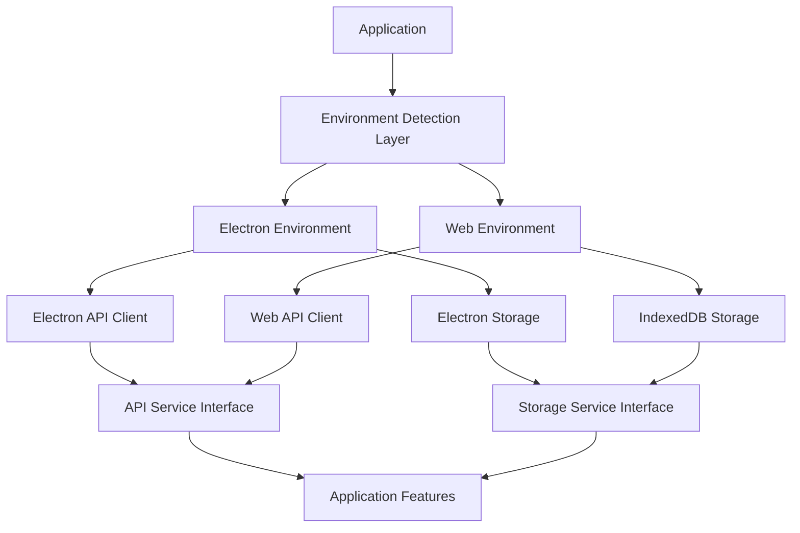

# Shortcut-Shortcut Web App Refactoring Plan

## Overview

This document outlines the plan to refactor Shortcut-Shortcut to function as both an Electron desktop application and a deployable web application. The refactoring will maintain all existing functionality in the Electron environment while adding support for web browsers, with shared code between platforms where possible.

## Architecture Overview

The refactoring will follow an adapter pattern that separates environment-specific implementations from shared business logic:



## Key Design Principles

1. **Adapter Pattern**: Implement adapters for both API and storage services that provide a consistent interface regardless of environment
2. **Environment Detection**: Single source of truth for determining the runtime environment
3. **Progressive Enhancement**: Web app maintains core functionality with graceful degradation for Electron-specific features
4. **Code Sharing**: Maximize shared code between platforms to minimize maintenance overhead
5. **Type Safety**: Maintain strong TypeScript types throughout the codebase

## Implementation Phases

### Phase 1: Environment Detection & API Abstraction

This phase will set up the foundation for environment-specific code paths:

1. **Environment Detection Utility**
   - Create utility functions for detecting Electron vs Web environment
   - Centralize platform-specific logic

2. **API Abstraction Layer**
   - Define common interface for API operations
   - Implement Electron IPC adapter (wrapping existing code)
   - Implement direct API client for web browsers
   - Create factory function for providing the correct implementation

3. **API Client Implementation Details**
   - Electron: Continue using IPC bridge to main process
   - Web: Make direct fetch calls to Shortcut API with CORS support
   - Both clients will implement the same interface
   - Update existing code to use the new abstraction layer

### Phase 2: Storage Abstraction

This phase will enable persistent storage in both environments:

1. **Storage Service Interface**
   - Define common interface for storage operations
   - Implement Electron adapter (wrapping electron-store)
   - Implement IndexedDB adapter using Dexie.js

2. **Data Migration Strategy**
   - Define schema for IndexedDB
   - Implement version migration support
   - Handle data export/import between platforms

3. **Cache Implementation**
   - Adapt current CacheContext to use the storage abstraction
   - Ensure consistent caching behavior across platforms

### Phase 3: Build System Updates

This phase will update the build process to support both targets:

1. **Webpack Configuration Updates**
   - Modify webpack configuration to support web target
   - Create separate entry points for Electron and web
   - Configure environment variables for build targets

2. **Web-Specific Optimizations**
   - Implement code splitting for web builds
   - Optimize bundle size
   - Configure proper asset loading paths

3. **Build Scripts**
   - Update package.json scripts for web builds
   - Create deployment configurations for web hosting

### Phase 4: Feature Compatibility Layer

This phase will ensure feature parity or graceful degradation:

1. **Feature Detection**
   - Identify Electron-specific features
   - Create web alternatives or graceful degradation paths

2. **UI Adaptations**
   - Update UI components to adapt to platform capabilities
   - Implement responsive design for web

3. **Testing & Validation**
   - Test all features in both environments
   - Document any platform-specific behavior

## Technical Implementation Details

### Environment Detection

```typescript
// src/renderer/utils/environment.ts
export const isElectron = (): boolean => {
  return window.electronAPI !== undefined;
};

export const getEnvironment = () => ({
  isElectron: isElectron(),
  platform: isElectron() ? (window as any).electronAPI.getPlatform() : 'web'
});
```

### API Service Interface

```typescript
// src/renderer/services/api/ShortcutApiService.ts
export interface ShortcutApiService {
  validateToken(token: string): Promise<boolean>;
  fetchProjects(token: string): Promise<ShortcutProject[]>;
  // other API methods...
}

// Factory function
export const createShortcutApiService = (): ShortcutApiService => {
  return isElectron() 
    ? new ElectronShortcutApiService() 
    : new WebShortcutApiService();
};
```

### Storage Service Interface

```typescript
// src/renderer/services/storage/StorageService.ts
export interface StorageService {
  get<T>(key: string, defaultValue?: T): Promise<T>;
  set<T>(key: string, value: T): Promise<void>;
  delete(key: string): Promise<void>;
  clear(): Promise<void>;
}

// Factory function
export const createStorageService = (): StorageService => {
  return isElectron() 
    ? new ElectronStorageService() 
    : new DexieStorageService();
};
```

### Dexie.js Implementation for Web Storage

```typescript
// src/renderer/services/storage/DexieStorageService.ts
import Dexie from 'dexie';

class TemplateDatabase extends Dexie {
  templates: Dexie.Table<Template, string>;
  
  constructor() {
    super('ShortcutShortcutDB');
    this.version(1).stores({
      templates: 'id, name'
    });
  }
}

export class DexieStorageService implements StorageService {
  private db = new TemplateDatabase();
  
  async get<T>(key: string, defaultValue?: T): Promise<T> {
    // Implementation...
  }
  
  // Other methods...
}
```

## Technology Choices

### IndexedDB/LocalStorage Library: Dexie.js

Selected for the following reasons:
1. Lightweight wrapper around IndexedDB (only 22KB min+gzip)
2. Clean promise-based API with TypeScript support
3. Excellent transaction handling
4. Schema version management for data migrations
5. Supports complex indices and querying
6. Active maintenance and community support

### Direct API Client: Fetch API

The web API client will use the native Fetch API for:
1. Broad browser support
2. Promise-based interface
3. Easy header management for auth tokens
4. Consistent with modern web standards

## Implementation Confidence Assessment

- **API Abstraction Layer**: 9/10
  - Clean separation already exists in the codebase
  - CORS is already handled by Shortcut servers
  - Direct API implementation is straightforward

- **Storage Implementation**: 8/10
  - Dexie.js provides a robust foundation
  - Storage patterns are clear and well-defined
  - IndexedDB is well-supported across modern browsers

- **Build System**: 9/10
  - Webpack configuration is already well-structured
  - Creating a web-specific entry point is straightforward
  - Code splitting will work well with the proposed architecture

- **Feature Compatibility**: 7/10
  - File import/export will need browser-based alternatives
  - May need to adjust some UX flows for web limitations

## Conclusion

This refactoring plan provides a clear path to enabling Shortcut-Shortcut to function as both an Electron app and a web app while maintaining a clean, maintainable codebase. By following this plan, we'll create a modular architecture that isolates platform-specific code while maximizing shared logic.
